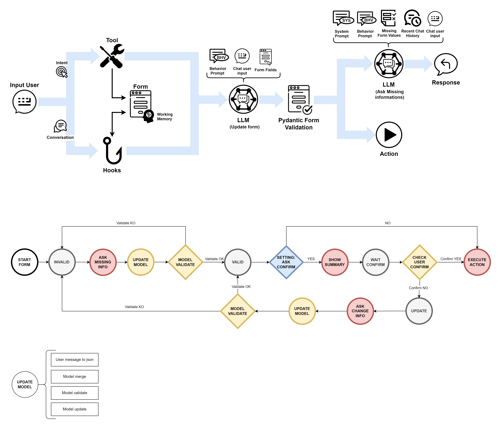

# Cat Conversational Form

the cat knows how to collect the data you need in a conversational way!


[](https://)  


## Usage

### 1) Prepare the pydantic model which extends CBaseModel class
```python 
class PizzaOrder(CBaseModel):
    pizza_type: str = Field(description="...", default="...")
    address:    str = Field(description="...")
    phone:      str = Field(description="...")
    #...
    
    # Implement execute action overriding method
    def execute_action(self):
        # execute action
        return # action output
    
    # Implement examples method	
    def examples(self):
        return [
            {
                "user_message": "My phone is: 123123123",
                "model_before": "{\"pizza_type\":\"Diavola\"}",
                "model_after":  "{\"pizza_type\":\"Diavola\",\"phone\":\"123123123\"}",
                "validation":   "ask_for: address; error: none",
                "response":     "Could you give me your delivery address?"
            },
            #...
        ]
```

### 2) Implement tool intent start
```python 
@tool(return_direct=True)
def intent_start(input, cat):
    ''' <docString> '''
    return PizzaOrder.start(cat)
```

### 3) Implement tool intent stop
```python 
@tool
def intent_stop(input, cat):
    ''' <docString> '''
    return PizzaOrder.stop(cat)
```

### 4) Implement agent_fast_reply & agent_prompt_prefix for dialog exchange
### (not necessary if the auto handle conversation setting is true)
```python 
@hook
def agent_fast_reply(fast_reply: Dict, cat) -> Dict:
    return PizzaOrder.dialogue_action(fast_reply, cat)

@hook
def agent_prompt_prefix(prefix, cat) -> str:
    return PizzaOrder.dialogue_prefix(prefix, cat)
```

## Flow
